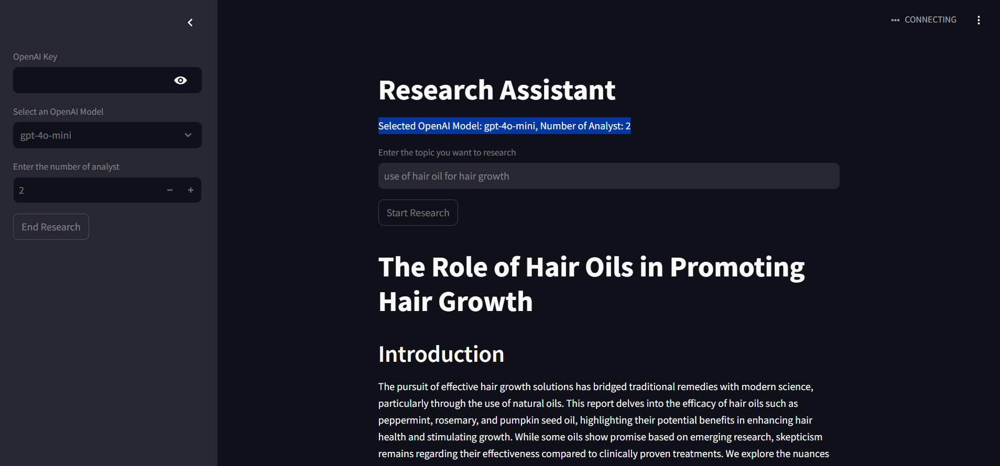
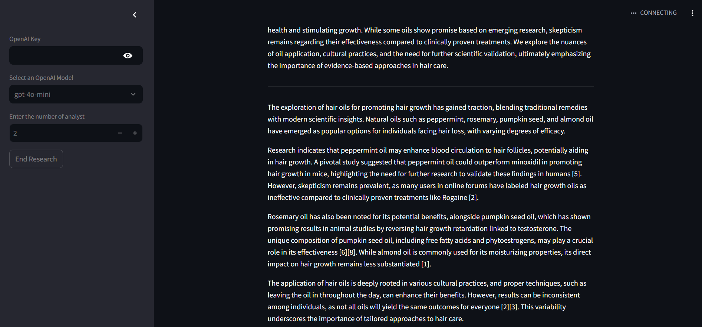

# Research Assistant

## Overview
Research Assistant is an intelligent tool that takes a topic as input and generates a detailed article on it. It utilizes multiple AI agents to research and compile information, providing well-structured insights.

## Features
- Accepts a topic as input
- Utilizes multiple AI agents for research
- Generates a well-structured article with images
- Provides concise and relevant information
- Supports multiple topics

## Installation
Ensure you have Python installed (version 3.7+ recommended).

1. Clone the repository:
   ```sh
   git clone https://github.com/Ravi10690/
   ResearchAssistant.git
   cd ReserchAssistant
   ```

2. Install dependencies:
   ```sh
   pip install -r requirements.txt
   ```

## Usage
Run the Streamlit app and provide a topic:

```sh
streamlit run app.py
```
Then, open `http://localhost:8501` in your browser.

## Configuration
Modify `.env` to adjust settings such as API keys, search depth, or output format.

## Example Output
```sh
Topic: Artificial Intelligence

Article:
Artificial Intelligence (AI) refers to the simulation of human intelligence in machines...
```

### Example with Images
Along with textual content, the assistant provides relevant images:





## Roadmap
- Add support for multiple output formats (PDF, Markdown)
- Implement citation support
- Enhance summarization capabilities

## Contributing
Pull requests are welcome! Please open an issue to discuss any major changes before submitting one.

<!-- ## License
This project is licensed under the MIT License - see the LICENSE file for details. -->

